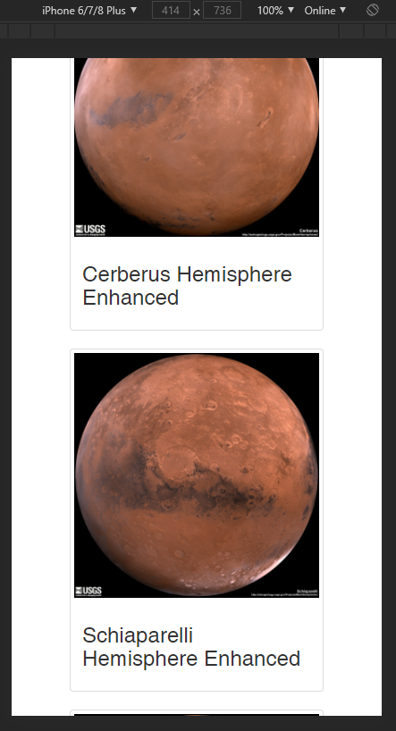

# Web Scraping Project - Mission to Mars

Using Jupyter Notebok, BeautifulSoup, Pandas, Flask, and Requests/Splinter, MongoDB, 
build a web application that contains any related information and images about Mars. 

## Scraping Work

* Scrape all the data in `mission_to_mars.ipynb`, which is a Jupyter Notebook file 
that contains all of my scraping and analysis works. 

* In these scrapes, they contain: `NASA Mars News title and description`, 
`urls for JPL Mars Space Featured Images in high resolution`, `Facts About Mars`, 
and `Mars Hemisphere Image urls`. 

## MongoDB + Flask App 

* Following images are working application in a local server. 
* Used Bootstrap for layout designs, which will work on all screen sizes. 

Copyright © Erika Yi 2020. All Rights Reserved.
